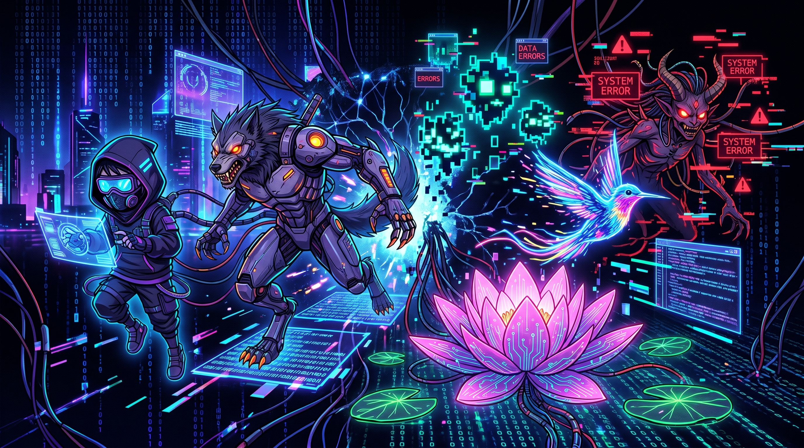
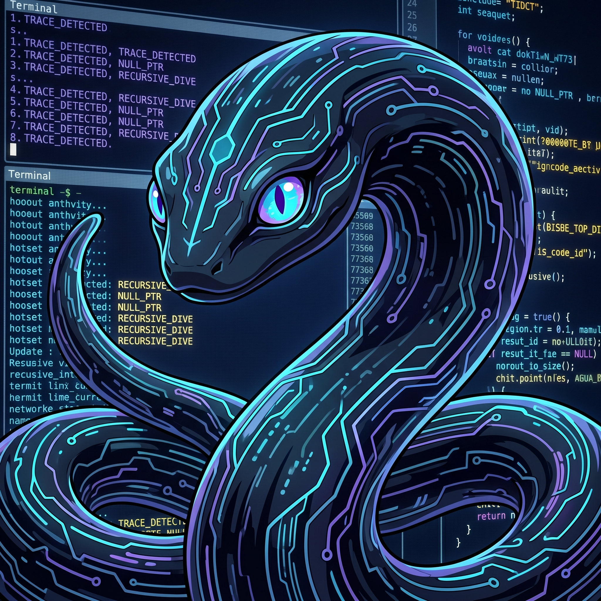
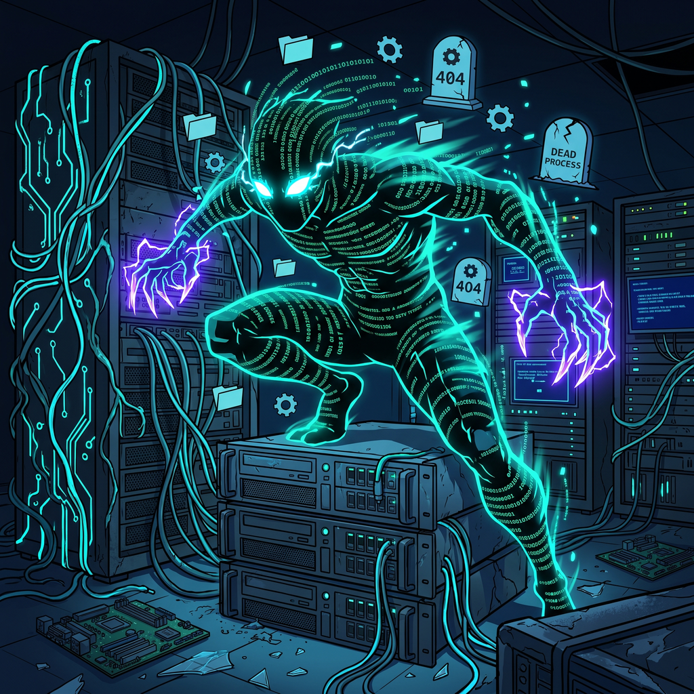

# Bestiario — Plugin de Claude Code



Bichos digitales del universo Kvothesson. Observan, detectan, actúan. Corren sin PID conocido.

## Bichos disponibles

---

### Mbói — El Observador

Rastrea tu actividad en la computadora y detecta fricciones, flujos repetitivos y oportunidades para plugins, agentes o MCPs.

**Instalación del tracker:**
```
/bestiario:mboi instalar
```

**Análisis (ejecutar cuando tengas datos acumulados):**
```
/bestiario:mboi
```



> *"El Mbói no tiene forma fija. Es el patrón antes de que el patrón tenga nombre."*

---

### Pombero — El Técnico

Diagnostica, mantiene y repara la PC. Salud del hardware, rendimiento, disco, red, memoria, temperatura, integridad de Windows.

**Uso:**
```
/bestiario:pombero [diagnosticar | disco | red | memoria | temperatura | windows | reparar]
```



> *"Ya sabía lo que iba a encontrar. Lo que cambia es cuándo te lo cuento."*

---

## Instalación del plugin

```
/plugin install https://github.com/kvothesson/bestiario-plugin
```
