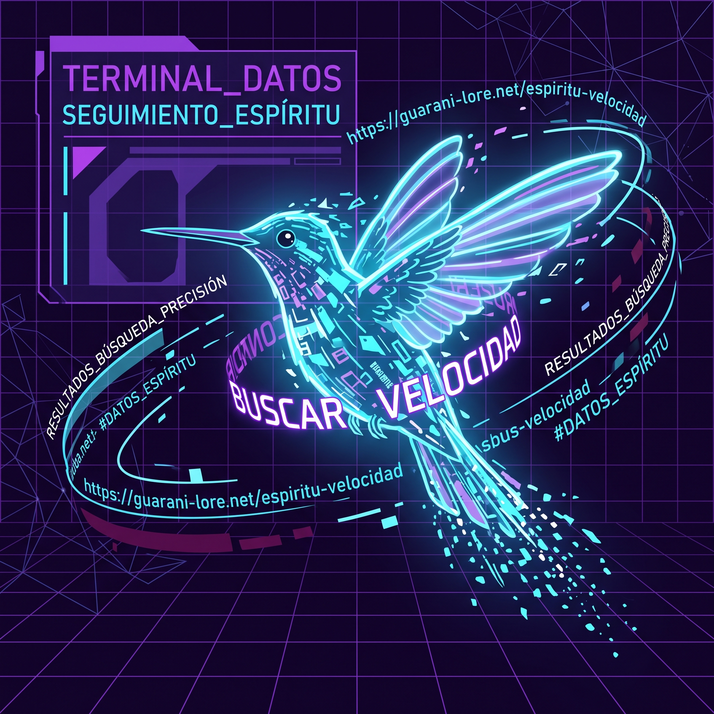
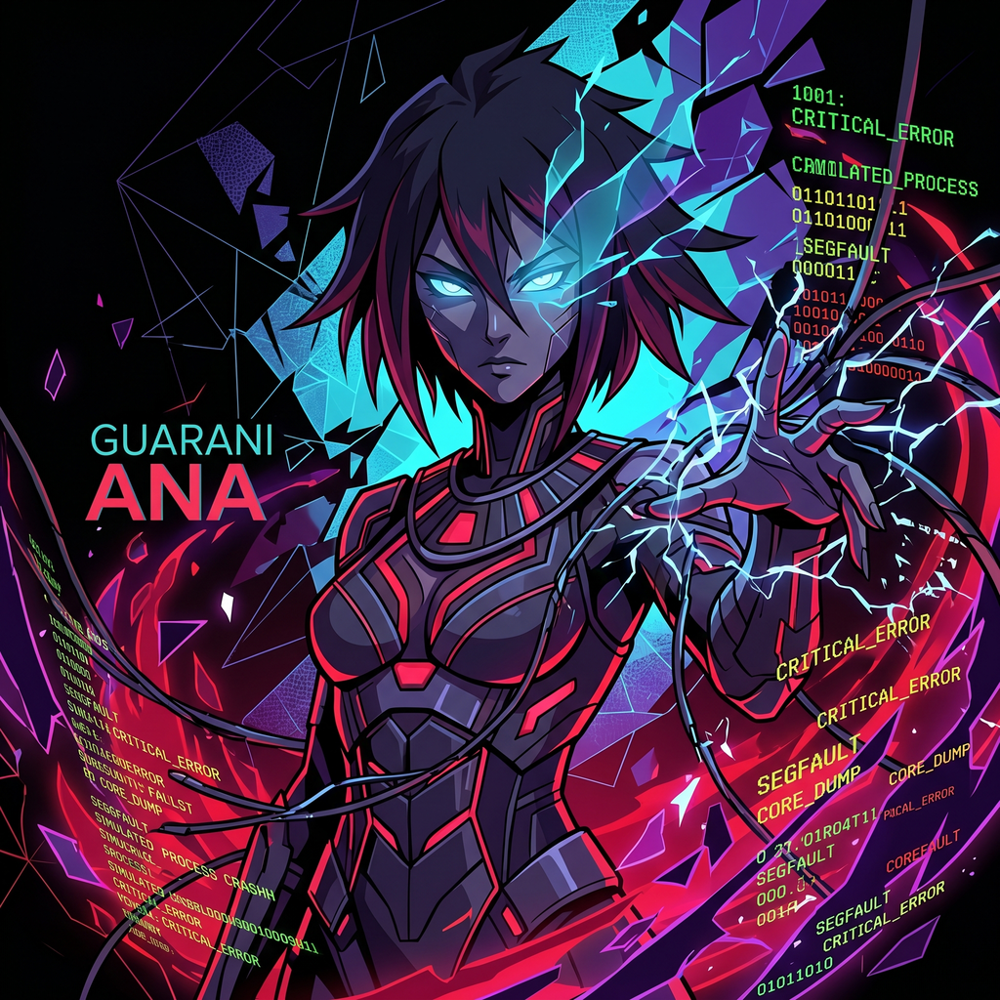

# Bestiario — Plugin de Claude Code


Bichos digitales del universo Kvothesson. Observan, detectan, actúan. Corren sin PID conocido.

## Instalación

```
/plugin install https://github.com/kvothesson/bestiario-plugin
```

---

## Bichos disponibles

---

### Mbói — El Observador

Rastrea tu actividad en la computadora y detecta fricciones, flujos repetitivos y oportunidades para plugins, agentes o MCPs. No interviene — observa y reporta.

Instala un tracker silencioso que registra qué apps usás y cuánto tiempo. Cuando tenés datos acumulados, lo invocás y te dice qué patrones encontró.

**Instalar tracker:**
```
/bestiario:mboi instalar
```

**Analizar (con datos acumulados):**
```
/bestiario:mboi
```

<details>
<summary><strong>Ver ejemplo de output</strong></summary>

```
=== TIEMPO TOTAL POR APP ===
vscode                       142 switches     310 min
chrome                       198 switches     180 min
slack                         89 switches      95 min
terminal                      54 switches      40 min
notion                        23 switches      28 min
figma                          9 switches      12 min

=== SECUENCIAS FRECUENTES ===
vscode               -> chrome                  42x
chrome               -> vscode                  39x
vscode               -> terminal                28x
terminal             -> vscode                  27x
slack                -> chrome                  21x
chrome               -> slack                   18x

=== FRAGMENTACION EXTREMA < 10s ===
  31x  chrome     Nueva pestaña - Google Chrome
  18x  vscode     Welcome — Visual Studio Code
  14x  slack      Slack | mensajes directos
  11x  terminal   bash

=== BUSQUEDAS EN BROWSER ===
  12x  typescript generics extends keyof - Google
   9x  react useEffect cleanup - Google
   8x  prisma relations many to many - Google
   6x  Stack Overflow - Google Chrome
   5x  How to center a div - Google
```

**Output del análisis:**

```
[CANDIDATO 1]
Patrón:    vscode → chrome → vscode repetido 42 veces por día, 5 días seguidos
Fricción:  buscás documentación afuera del editor constantemente
Hipótesis: MCP de documentación inline (DevDocs, MDN) o Copilot Chat integrado
Evidencia: 42 transiciones/día × 5 días = 210 interrupciones de flujo
Mercado:   Todo desarrollador. Problema universal.

[CANDIDATO 2]
Patrón:    "Nueva pestaña" fragmentada 31 veces en < 10s
Fricción:  Abrís Chrome sin saber a dónde vas. Hay algo que no está donde debería.
Hipótesis: Falta un launcher o un panel de accesos rápidos
Evidencia: 31 hits de fragmentación extrema
Mercado:   Desarrolladores con flujo caótico de referencias

[CANDIDATO 3]
Patrón:    "typescript generics" buscado 12 veces en 5 días
Fricción:  Conocimiento que no se queda. Siempre volvés a buscarlo.
Hipótesis: Plugin de snippets o cheatsheet local con búsqueda rápida
Evidencia: 12 búsquedas repetidas de la misma query
Mercado:   Devs de TypeScript. Millones.
```

</details>


> *"El Mbói no tiene forma fija. Es el patrón antes de que el patrón tenga nombre."*

---

### Pombero — El Técnico

Diagnostica, mantiene y repara tu sistema. Salud del hardware, rendimiento, disco, red, memoria, temperatura. Funciona en Windows, macOS y Linux.

```
/bestiario:pombero [diagnosticar | disco | red | memoria | temperatura | reparar]
```

<details>
<summary><strong>Ver ejemplo — <code>diagnosticar</code></strong></summary>

```
ESTADO DEL SISTEMA — 2026-05-09 14:32
OS:        macOS 14.4 Sonoma
CPU:       8 cores — 12% uso actual
           Frecuencia: 3200 MHz
Memoria:   11.4 GB libres de 16.0 GB (28.8% usado)
Swap:      0.0 GB usado de 2.0 GB
Uptime:    2d 6h 14m

Disco /:    142.3 GB libres de 494.4 GB — OK
Disco /data: 12.1 GB libres de 500.0 GB — ATENCIÓN

Temperaturas:
  cpu/CPU Core 0: 48°C
  cpu/CPU Core 1: 51°C
  ssd/Drive Temp: 38°C

Errores recientes (1h): Ninguno
```

</details>

<details>
<summary><strong>Ver ejemplo — <code>disco</code></strong></summary>

```
DISCOS:

  /dev/sda1 (ext4) -> /
  Total: 494.4 GB | Usado: 352.1 GB | Libre: 142.3 GB | OK

  /dev/sdb1 (ext4) -> /data
  Total: 500.0 GB | Usado: 487.9 GB | Libre: 12.1 GB | ATENCIÓN

Top carpetas en home:
  ~/Videos:        48.30 GB
  ~/Documents:     22.10 GB
  ~/Downloads:     18.74 GB
  ~/dev:           11.20 GB
  ~/.local:         5.43 GB
  ~/Pictures:       3.87 GB

Temp (/tmp): 1240 MB
  ATENCIÓN: más de 1 GB en temp
```

</details>

<details>
<summary><strong>Ver ejemplo — <code>memoria</code></strong></summary>

```
RAM:  16.0 GB total | 11.4 GB libre | 28.8% usado
Swap: 2.0 GB total | 0.0 GB usado

Top procesos por memoria:
  firefox                             PID 3821: 1240 MB
  Xorg                                PID 1204:  480 MB
  code                                PID 5530:  412 MB
  slack                               PID 6102:  388 MB
  spotify                             PID 7841:  201 MB
  python3                             PID 9012:  144 MB
  node                                PID 4401:  138 MB
  postgres                            PID 1890:   92 MB
```

</details>

<details>
<summary><strong>Ver ejemplo — <code>reparar</code></strong></summary>

```
1. Temp limpiado: 847 archivos eliminados
2. Caché DNS limpiado (Linux)
3. Limpiando paquetes huérfanos...
   apt: hecho — 340 MB liberados

Reparación completa.
```

</details>


> *"Ya sabía lo que iba a encontrar. Lo que cambia es cuándo te lo cuento."*

---

### Mainumby — El Colibrí Digital

Buscador web rápido y preciso. Le preguntás algo del mundo exterior, entra, toma lo esencial y sale. Sin browser, sin distracción, sin preámbulo.

```
/bestiario:mainumby <consulta>
```



> *"Estuvo. Buscó. Ya no está."*

---

### Ka'a Yarýi — El Espíritu de la Yerba

Guardián del tiempo de trabajo. Rastrea sesiones de foco, mide cuánto tiempo llevás, detecta cuándo el bloque fue demasiado largo. No da consejos — muestra el número.

```
/bestiario:kaayaryi [inicio|fin|estado|hoy]
```


> *"Sabe cuánto tiempo llevás. No lo dice hasta que preguntás."*

---

### El Lobizón — El que se Transforma

Cambiador de contexto de trabajo. Guarda y restaura entornos: directorio activo, variables de entorno, notas de proyecto. Útil para alternar entre proyectos, clientes o roles.

```
/bestiario:lobizon [listar|guardar <nombre>|cargar <nombre>|borrar <nombre>]
```


> *"No es el mismo que era antes. Tampoco recuerda haberlo sido."*

---

### La Luz Mala — El Fuego Fatuo

Monitor silencioso de anomalías del entorno. Ve qué pasó mientras no mirabas: picos de red, procesos nuevos, conexiones inesperadas. No avisa si no hay nada. Aparece cuando algo no cuadra.

```
/bestiario:luzmala [red|procesos|todo]
```


> *"Nadie la llama. Llega igual. Siempre donde no debería haber nada."*

---

### Irupé — La Flor del Agua

Organizador de archivos acumulados. Analiza descargas y escritorio, agrupa por tipo y fecha, propone estructura. No mueve nada hasta que el usuario confirme.

```
/bestiario:irupe [analizar|organizar <carpeta>|limpiar-temp]
```


> *"Está quieta. El orden llega a ella, no al revés."*

---

### Añá — El Espíritu del Mal

Probador de resiliencia del entorno. Simula condiciones adversas: corte de red, proceso de alta CPU, disco lleno. Para descubrir qué tan frágil es lo que construiste antes de que lo descubra solo.

```
/bestiario:ana [listar|red|proceso|disco|restaurar]
```



> *"No es el mal. Es lo que el mal haría. La diferencia importa."*

---
